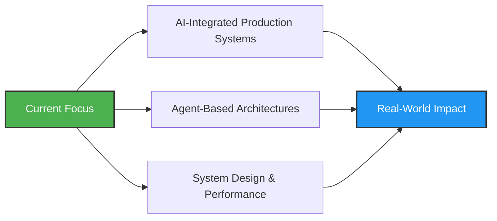

# 👋 Hi, I'm Ziyad Tber

### Software Engineer Intern @ INVENEO | AI Enthusiast | Full-Stack Developer

*Building scalable web systems and AI-powered applications*

---

## 🚀 About Me

I'm a **Software Engineering student** and **Software Engineer Intern at INVENEO**, passionate about building production-grade systems that make a real impact. My work spans from **accessible web platforms** to **AI-powered humanitarian applications**.

## 💼 Professional Experience

### 🔹 Software Engineer Intern — **INVENEO**

> *Building accessible, scalable web platforms with modern technologies*

- 🌐 Developing and improving accessible web platforms
- ♿ Implementing **a11y standards** to ensure inclusive user experiences
- ⚡ Optimizing performance and usability across diverse user environments
- 🤝 Collaborating in **agile teams** to deliver maintainable solutions
- 💻 Writing clean, scalable, and structured frontend and CMS-integrated code

### 🔹 Google DeepMind Hackathon

> *Humanitarian AI Translation App*

- 🤖 Developed an **AI-powered humanitarian translation system**
- 🔄 Built machine learning workflows and data processing pipelines
- 🌍 Integrated **LLM-based technologies** for real-world humanitarian impact

---

## 🎯 Core Focus Areas

<table>
<tr>
<td width="50%">

### 🤖 AI & Machine Learning
- AI Agents & LLM Applications
- Machine Learning & Fine-Tuning
- Data Processing & Automation

</td>
<td width="50%">

### 💻 Software Engineering
- Full-Stack Web Development
- API Design & Integration
- Scalable System Architecture

</td>
</tr>
</table>

---

## 🛠️ Technical Arsenal

### Languages

### Frontend Development

### Backend & Databases

### AI & Machine Learning

### Tools & Platforms

---

## 🏆 Achievements

### 🥇 First Place — School Python Competition
**Specialized Institute Of Applied Technology NTIC**

---

## 📈 Current Direction

- 🔨 Building **AI-integrated production systems**
- 🎯 Advancing in **agent-based architectures**
- 📊 Strengthening **system design and performance optimization**
- 🌱 Continuously learning and adapting to emerging technologies

---

## 📊 GitHub Stats

## 💡 What I'm Working On

- 🤖 Exploring **advanced AI agent frameworks**
- 🏗️ Building **scalable microservices architectures**
- 📚 Deepening knowledge in **distributed systems**
- 🌐 Contributing to **open-source projects**

---

## 🤝 Let's Connect!

I'm always interested in collaborating on innovative projects, especially those involving:
- 🤖 AI Agents and LLM Applications
- 🌍 Humanitarian and Social Impact Tech
- 🚀 Scalable Web Applications
- 📊 Machine Learning Solutions

**💬 Feel free to reach out for collaborations or professional discussions.**

---

⭐️ From [Ziyad Tber](https://github.com/ziyad455)

